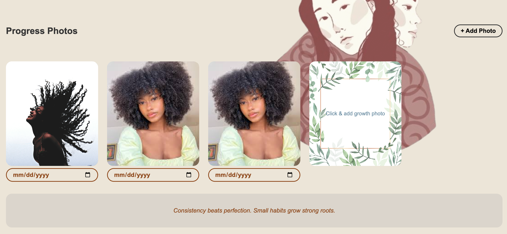

# 🌿 Rooted

Rooted is a user-centered hair profile application that allows individuals to create an account, log in, and store personalized hair information such as hair type, porosity, and photos.

This project focuses on managing user-specific state in a frontend React application while simulating backend persistence using localStorage. Each user’s data is scoped and stored independently to prevent overlap between accounts.

Rooted emphasizes both functionality and thoughtful design. Because hair identity is personal, the interface was intentionally built to feel clean, organized, and welcoming. Special attention was given to state management, conditional rendering, and proper loading states to ensure a smooth user experience.

## ✨ Features

- User registration and login

- Persistent hair profile storage using localStorage

- User-specific data management

- Profile photo storage

- Conditional rendering with loading states

- Deployed using GitHub Pages

## 👷🏼‍♀️ Built With

- React

- Vite

- JavaScript

- CSS

- Git & GitHub

- GitHub Pages (deployment)

## 📷 Photos

### 🔗 Links

- [Rooted](https://arieepal.github.io/rooted-frontend/)
- [Rooted Live](https://www.loom.com/share/c1c85484f1964481885d339165e1122f)
